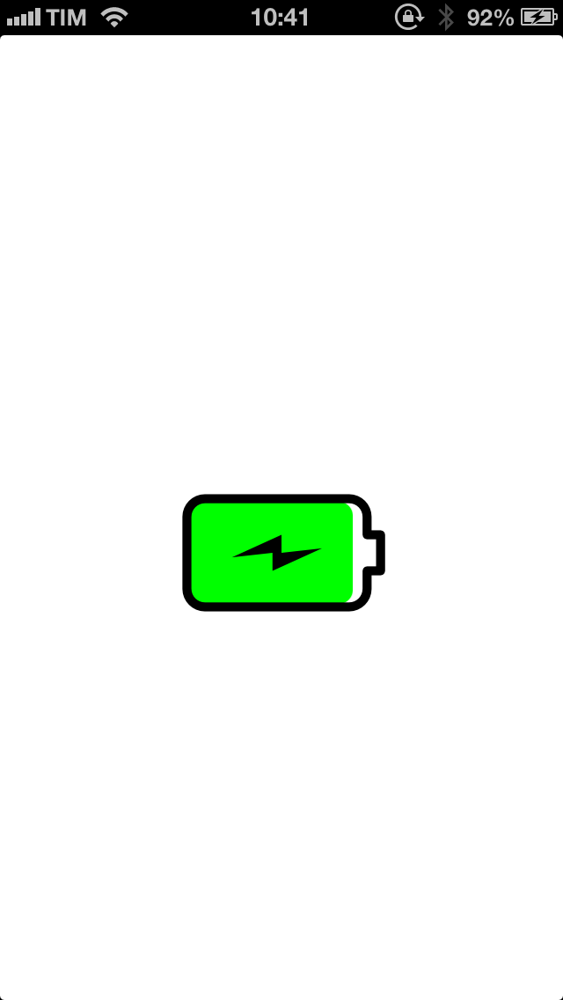

#What is
This class allow you to show a battery image and fill it with the current real charge.
The color of the fill view depends by the battery level.

#Usage
The usage is simple.

	ALBatteryView *batteryView = [[ALBatteryView alloc] initWithFrame:CGRectMake(20, 40, 80, 80)];
    [self.view addSubview:batteryView];
    [batteryView setBatteryLevelWithAnimation:YES forValue:[UIDevice currentDevice].batteryLevelInPercentage inPercent:YES];
    
This will create a view of type ALBatteryView with the frame you want, will add it to the current view and will call the method to set the battery level.
The *batteryLevelInPercentage* method is available thanks to a category of *UIDevice* declared in the header of *ALBatteryView*.
This will animate the view filling the battery

#Limitation
The battery view can be maximum 128x128 (width, height), this is because the png is 256x256 pixels.
The battery view **have** to be a square, so the width and the height **have** to be the same.

#License
Licesed under the MIT License.